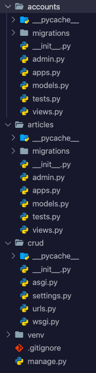

# Django로 웹사이트 만들기 1: 프로젝트 시작하기

### 프로젝트 목표

앞으로 Django를 활용해서 간단한 카페 찾기 / 리뷰 웹사이트를 구현하면서 장고로 웹사이트 구축하는 과정을 정리하고 기록으로 남겨보기로 했다.

- 카페 리뷰 게시판 구현 (CRUD)
- 카페 검색 기능
- 카페 좋아요 / 저장 기능 구현
- 지도로 카페 위치 표시
- 로그인 기능 구현


프로젝트를 시작하기에 앞서 간단히 Django란 무슨 프레임워크인지, 어떻게 동작하는지, 그리고 기본적인 환경설정을 하는 방법을 먼저 정리해보았다.

#### Static vs. Dynamic Website

**Static**: 정해진 것 만을 제공해 주는 웹사이트

**Dynamic**: DB와의 통신을 거쳐서 사용자가 원하는 데이터를 동적으로 제공해 주는 웹사이트

장고의 경우 DB와의 통신까지 지원하는 server side framework이다


#### Django의 기본 동작 원리

**Model**: 데이터를 관리 해주는 역할 (MVC에서 Model과 같은 역할)

**Template**: 보여지는 페이지를 만드는 역할 (MVC에서 View와 같은 역할)

**View**: 어떤 동작을 수행할지 알려주는 중간 관리자 (MVC에서 Controller와 같은 역할)

**(+) urls.py:** 어떤 특정 경로로 들어온 요청이 어느 view로 연결될지 알려주는 기능

**요청 처리 순서**: urls를 통한 요청 ---> view 함수로 연결 --> model에서 필요 정보 수집 --> template render


#### 가상환경 설정하기 (선택)

선택사항이지만 프로젝트의 독립적인 관리를 위해서는 가상환경을 사용하는것이 좋다!

각 프로젝트마다 필요한 패키지, 버젼등등이 다를 수 있기 때문에 새로운 가상환경을 하나 설치에서 그 가상환경안에 알맞는 버젼의 패키지를 깔아주면 된다

1. 가상환경 생성

```bash
$ python -m venv venv
```

2. 가상환경 activate

```bash
$ source venv/bin/activate
```

3. 장고 설치

```bash
$ pip install django
```

4. (optional) 진행되고 있는 프로젝트를 받아와서 requirements 파일이 이미 있는 경우

```bash
$ pip install -r requirements.txt
```


#### 장고 프로젝트 시작하기

터미널에서 다음 코드를 입력하면 된다

```bash
$ django-admin startproject <project_name>
```

find_my_cafe 라는 이름의 프로젝트를 만드려면 (새로 하위 폴더를 생성하는 것이 아닌 현재 디렉토리에서 프로젝트를 생성하려면 `.`을 끝에 추가해주면 된다):

```bash
$ django-admin startproject find_my_cafe .
```


#### 새로운 앱 추가하기

**App**: 장고 안에서 특정 기능을 수행하는 모듈들의 단위

1. 앱을 생성한다: articles와 accounts라는 이름의 앱을 생성해준다

```bash
$ python manage.py startapp board
$ python manage.py startapp accounts
```

2. settings.py 파일안에 installed apps에 방금 만든 app을 추가한다

```python
INSTALLED_APPS = [
    # 1. local apps
  	'accounts',
    'articles',
    # 2. 3rd-party apps
    # 3. django apps
    'django.contrib.admin',
    'django.contrib.auth',
    'django.contrib.contenttypes',
    'django.contrib.sessions',
    'django.contrib.messages',
    'django.contrib.staticfiles',
]
```


**최종 파일 트리 모양**




#### Settings.py 설정하기

기본적인 세팅과 더불어 다음과 같이 추가 설정을 해준다

1. 언어와 지역 설정을 지역에 알맞게 해준다. 한국의 경우:

```python
LANGUAGE_CODE = 'ko-kr'

TIME_ZONE = 'Asia/Seoul'
```

2. 기본 templated을 찾을 수 있는 template 경로를 설정해준다

```python
TEMPLATES = [
  {
    'DIRS': [
      BASE_DIR / '<app_name>' / 'templates'
    ]
  }
]
```

3. Base User Model을 대체해준다 (나중에 회원가입, 로그인 기능에 필요한 User 모델을 초기 프로젝트를 만들때 대체 설정을 해줘야한다 -- 나중에는 매우 고치기 힘듬!)

   1. accounts/models.py에 다음 코드를 추가한다

   ```python
   from django.contrib.auth.models import AbstractUser
   
   class User(AbstractUser):
       pass
   ```

   2. settings.py 맨 밑에 다음 한줄을 추가한다

   ```python
   AUTH_USER_MODEL = 'accounts.User'
   ```


#### 장고 서버 실행하기

```bash
# manage.py가 있는 프로젝트 root_folder 안에서 실행해야함
$ pwd
~/<project_root_folder>

$ python manage.py runserver
```


#### 협업 환경 (Github) 세팅하기 (선택)

1. `.gitignore` 파일 만들기

```bash
$ touch .gitignore
```

2. `.gitignore` 파일에 필요한 것들을 <a href="https://www.toptal.com/developers/gitignore">gitignore.io</a> 웹사이트에서 찾아서 파일에 복사 / 붙여넣기 해서 추가한다: Python, Django, MacOS, Windows 정도 추가하면 이 프로젝트에서는 충분한 것 같다!
3. Github 에서 새로운 repository를 생성한다
4. 터미널 창에서 remote branch와 연결시켜준다

```bash
$ git remote add origin <remote 주소>
```

5. Inital add / commit / push를 해준다


#### 환경 변수 관리 (선택)

프로젝트를 git에 올리게되면 `SECRET_KEY` 와 같이 오픈된 환경에서는 노출되면 안되는 정보들이 있다. 이런 정보들을 배포하지 않고 로컬환경에만 관리할 수 있도록 환경 변수 설정을 해주는 라이브러리들이 장고에는 존재한다.

Django-environ: https://django-environ.readthedocs.io/en/latest/

1. `Django-environ` 설치

```bash
$ pip install django-environ
```

2. `settings.py` 상단에 아래 코드 추가

```python
import environ
import os

env = environ.Env(
    # set casting, default value
    DEBUG=(bool, False)
)

# Set the project base directory
# Change the original BASE_DIR to this line
BASE_DIR = os.path.dirname(os.path.dirname(os.path.abspath(__file__)))
```

3. 환경변수를 저장할 `.env` 파일 생성 후 아래 코드 추가 (실제 `settings.py` 파일에서 SECRET_KEY를 가져와서 사용)

```makefile
DEBUG=True
ALLOW_ROBOTS=False
SECRET_KEY=secret
ADMINS="John Doe <john@example.com>, Mary <mary@example.com>"
MANAGERS="Blake <blake@cyb.org>, Alice Judge <alice@cyb.org>"
SERVER_EMAIL=webmaster@example.com
```

4. `settings.py` 에서 `.env` 파일에 저장된 환경변수를 사용할 수 있도록 코드를 변경한다

```python
# delete existing SECRET_KEY and use this line instead
SECRET_KEY = env('SECRET_KEY')
```

