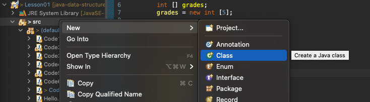

# Java 기본 문법: 자바 프로젝트 및 클래스 생성

자바 파일을 실행하기 위해서는 자바 프로젝트와 클래스가 필요하다

1. Src 폴더에서 우클릭하여 new > class를 선택해 새로운 클래스를 만들어준다




2. 다음과 같이 이름과 설정을 한 후 Java Class를 만들어준다
   - 클래스 이름은 대문자로 작성하기!


3. 파일을 생성하면 좌측 파일 트리에 자바 코드 작성을 위한 `.java` 확장자의 파일이 만들어진다.
   1. `.java`: 개발자가 실제 코드를 작성하는 human readable한 자바 파일
   2. `.class`: .java 파일을 실행하게 되면 내부적으로 코드를 compile하여 .class 확장자를 가진 파일을 만드는데 이 compile 과정을 통해 실제로 코드가 실행된다


처음 Class를 만들었을때 코드 형태:

```java
public class Code9 {

	public static void main(String[] args) {
		// 이 안에 코드를 작성하면 된다
	}
}
```

