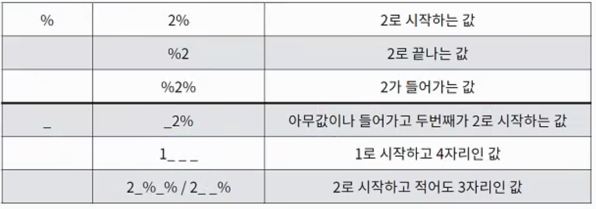

# Intro to SQL (SQLite)

SQLite 명령어: `.`로 시작하는 것들

SQL 언어 명령어: `;`으로 끝나는 것들

## 데이터베이스 생성 / 불러오기

1. 데이터베이스 만들기

```bash
$ sqlite3 <db_name>.sqlite3
```

2. 데이터베이스 생성

```sqlite
.databases
```

3. csv 파일 불러와서 db에 저장

```sqlite
-- csv 파일을 불러오겠다
.mode csv
-- hello를 examples라는 이름의 테이블로 불러오기
.import hello.csv examples
```

4. (추가 설정) 데이터베이스 권한 설정

- 데이터베이스에 쓰기 권한이 부여 되어 있지 않으면 DDL 명령어를 수행할때 에러가 날 수도 있다
- 그럴 경우 sqlite CLI 에서 나가서 데이터베이스에 권한 부여를 해주면 된다

```bash
$ chmod 664 <db_name>.sqlite3
```


---

## DDL (Data Definition Language)

### 테이블 생성 (CREATE)

**기본적인 테이블 생성 syntax**

```sqlite
CREATE TABLE classmates(
	id INTEGER PRIMARY KEY,
  name TEXT NOT NULL,
  age INT NOT NULL,
  address TEXT NOT NULL
);
```

**테이블 생성 시 줄 수 있는 속성 값**

- 데이터 타입 (밑에 테이블 참조)
- NULL / NOT NULL
- PRIMARY KEY / FOREIGN KEY
- AUTOINCREMENT: 인덱스 값에 줄 수 있는 설정 - 자동으로 번호가 올라가게 하고, 한번 사용했던 번호는 지워지더라도 다시 재사용 하지 않음

##### **대표적인 데이터 타입**


### 테이블 조회 (READ)

생성한 테이블 조회

```sqlite
.tables
```

테이블의 스키마 조회

- 내가 만든 테이블에 관해서만 가능

```sqlite
.schema <table_name>
```

### 테이블 수정 (UPDATE - SQL: ALTER)

- 테이블 이름, 컬럼 이름 등을 바꿀 수 있음
- 컬럼을 추가 할 수 있음

```sqlite
-- 테이블 이름 바꾸기
ALTER TABLE articles RENAME TO news;
-- 컬럼 추가
ALTER TABLE news ADD COLUMN created_at TEXT;
```


### **테이블 삭제** (DELETE)

```sqlite
DROP TABLE <table_name>
```


---

## DML (Data Manipulation Language)

### 데이터 조회 (READ - SQL: SELECT)

**SELECT ~ FROM~**: 가장 기본적인 데이터 조회 방법

- SELECT * 를 통해 전체 데이터 조회 가능
- SQLite에서는 PRIMARY KEY를 지정하지 않으면 자동 생성되는 rowid를 통해 고유 인덱스 값을 불러올 수 있다
  - *INTEGER PRIMARY KEY 타입으로 컬럼을 만들면 rowid는 생성되지 않는다*

```sqlite
SELECT * FROM examples;
```

특정 컬럼만 가져오기

```sqlite
SELECT last_name, first_name FROM users;
```

** 추가 설정 (데이터 조회를 더 쉽게 할 수 있는 설정들)

```sqlite
-- column header와 같이 데이터 조회
.headers on
-- 데이터를 테이블처럼 보여준다
.mode column
```


**LIMIT**: 가져올 row의 수를 지정할 수 있다

```sqlite
SELECT rowid, name FROM classmates LIMIT 1;
```

**OFFSET**: 몇개를 건너띄고 시작할지 지정

```sqlite
-- 두개를 건너띄고 3번째 행부터 출력
SELECT rowid, name FROM classmates LIMIT 1 OFFSET 2;
```

**DISTINCT**: 중복되는 값 없이 데이터를 불러온다

```sqlite
SELECT DISTINCT age FROM classmates;
```


#### 조건을 활용한 조회

**WHERE**: 어떤 데이터를 가지고 올지 조건을 지정해 준다

- WHERE의 가장 기본적인 사용 방법

```sqlite
SELECT rowid, name FROM classmates WHERE address='서울';
```

- 비교 / 논리 연산자 활용

```sqlite
SELECT last_name, age FROM users WHERE age>=30 and last_name='김';
```

- **LIKE**: 문자열 비교 연산자 활용 (wild cards)
  - `_`: 반드시 이 자리에 한개의 문자가 존재해야 함
  - `%`: 이 자리에 문자가 있을수도, 없을수도 있음
  - 문자열로 바꿔서 값을 비교하기 때문에 원래 string type이 아닌 문자도 LIKE 연산자로 비교할 수 있음



```sqlite
-- 지역번호가 02인 유저들 불러오기
SELECT * FROM users WHERE phone LIKE '02%';
-- 이름이 준으로 끝나는 유저들 불러오기
SELECT * FROM users WHERE first_name LIKE '%준';
```


#### 계산된 값을 활용한 조회

**COUNT**: 레코드 수를 계산해서 출력

```sqlite
-- users 테이블의 전체 레코드 수 출력
SELECT COUNT(*) FROM users;
```

**AVG**: 레코드들의 평균 값을 계산해서 출력

```sqlite
-- users table의 나이가 30이상인 사람들의 평균 나이 출력
SELECT AVG(age) FROM users WHERE age>=30;
```

**MIN / MAX**: 레코드 중 최소/최대 값을 찾아서 출력

```sqlite
SELECT MAX(balance), first_name FROM users;
```


#### 정렬을 활용한 조회

**ORDER BY**: 정렬을 해준다

- ASC / DESC를 활용해서 오름차순/내림차순 정렬을 해준다
- 정렬 기준을 명시해주지 않으면 기본값이 ASC
- 여러 값을 기준으로 정렬할 수도 있다

```sqlite
-- 나이를 기준으로 오름차순 정렬
SELECT * FROM users ORDER BY age;
-- 나이, 성을 기준으로 오름차순 정렬 뒤 상위 10개만 뽑아오기
SELECT * FROM users ORDER BY age, last_name LIMIT 10;
SELECT last_name, first_name FROM users ORDER BY balance DESC LIMIT 10;
```


#### 그룹별로 값을 묶어서 조회

**GROUP BY**: 값을 그룹별로 묶어준다

```sqlite
-- 성씨 별로 몇명의 유저가 있는지 부분합을 계산해 주는 sql 구문
SELECT last_name, COUNT(*) FROM users
GROUP BY last_name;

-- column값에 대한 alias를 지정해 줄 수도 있다
SELECT last_name, COUNT(*) AS name_count FROM users
GROUP BY last_name
ORDER BY name_count;
```


### 데이터 생성 (CREATE - SQL: INSERT)

```sqlite
-- 모든 컬럼에 데이터 삽입
INSERT INTO classmates VALUES('홍길동', 30, '서울')

-- 특정 지정한 컬럼에만 데이터 삽입
INSERT INTO classmates(name, age)
	VALUES('홍길동', 23);
	
-- 함수를 활용해서 데이터 삽입
INSERT INTO news VALUES ('TITLE 1', 'CONTENT 1', datetime('now'))
```

**주의해야 할 점**

- NOT NULL 속성이 지정 된 컬럼은 반드시 넣어야 한다


### 데이터 삭제 (DELETE - SQL: DELETE)

```sqlite
DELETE FROM classmates WHERE id=4
```


### 데이터 수정 (UPDATE - SQL: UPDATE)

일반적으로는 데이터를 수정할 때 특정 몇개의 데이터만 수정하기 때문에 WHERE 절과 함께 많이 사용된다

```sqlite
UPDATE classmates SET name="홍길동", address="제주도" WHERE rowid=4;
```

