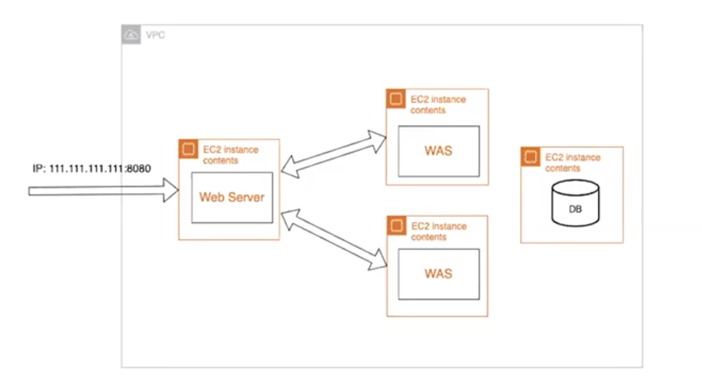

# Webserver

### Webserver란?

웹 브라우저로부터  Http 요청을 받아 HTML 문서와 같은 **정적 컨텐츠**를 제공하는 프로그램

- 정적 컨텐츠: 어느 사용자이던지 간에 상관하지 않고 같은 것을 제공하는 컨텐츠
- 예시) Nginx, Apache


### Web Application Server란? (WAS)

DB조회나 다양한 로직 처리를 요구하는 동적인 컨텐츠를 제공하기 위해 만들어진 프로그램

- 동적 컨텐츠: 요청 인자에 따라 바뀔 수 있는 컨텐츠, DB와의 통신을 통해 동적인 컨텐츠 제공

- 예시) Tomcat

- **Web Container 또는 Servlet Container**라고 불리는 부분이 특정 url을 servlet과 매칭 시키는 부분을 담당하여, 권한과 설정에 맞는 정보를 불러오는 역할을 수행한다

  - JSP: 자바코드를 포함하고 있는 html 페이지
  - Servlet: html 코드를 포함하고 있는 자바 코드

  ```java
  // Extend HttpServlet class
  public class HelloWorld extends HttpServlet {
   
     private String message;
  
     public void init() throws ServletException {
        // Do required initialization
        message = "Hello World";
     }
  
     public void doGet(HttpServletRequest request, HttpServletResponse response)
        throws ServletException, IOException {
        
        // Set response content type
        response.setContentType("text/html");
  
        // Actual logic goes here.
        PrintWriter out = response.getWriter();
        out.println("<h1>" + message + "</h1>");
     }
  
  }
  ```

  

#### WAS의 특징

- 클라이언트로부터 http 요청을 받을 수 있다
- 요청에 맞는 정적 컨텐츠를 제공할 수 있다 (대부분의 WAS는 Web Server 내장)
- DB 조회나 다양한 로직 처리를 통해 동적 컨텐츠를 제공할 수 있다


### WAS가 있을때 Webserver가 따로 필요한 이유

1. 책임 분할을 통한 **서버 부하 방지**
   - 정적 컨텐츠 => Web Server
   - 동적 컨텐츠 => WAS
2. 여러대의 WAS를 활용한 **로드밸런싱**
   - 한대의 Web Server로 요청을 받아도 여러대의 WAS가 나누어서 요청을 처리할 수 있는 구조로 부하를 분산시킬 수 있다
   - Health Check 가능
     - 여러대의 WAS를 사용할 경우, 그 중 하나의 WAS에서만 문제가 생기는 경우가 있을 수 있음
     - 서버의 주기적으로 http 요청을 보내 서버의 상태를 확인 가능 (200 response가 오는지 체크)
     - 이상이 생길 경우 자동으로 비정상 서버로 간주하여 연결을 차단하도록 설정 가능



3. 보안 강화
   - WAS는 DB 관련 로직과 접근 권한을 가지고 있기 때문에 외부에 노출되면 위험할 수 있다
   - 앞단에 Web Server를 배치해서 실제 서버를 외부에 노출하지 않을 수 있다 (리버스 프록시)


### Web Server를 따로 두고 있는 구조


#### 자세한 동작 과정

1. Web Server는 웹 브라우저 클라이언트로부터 HTTP 요청을 받는다.

2. Web Server는 클라이언트의 요청(Request)을 WAS에 보낸다.

3. WAS는 관련된 Servlet을 메모리에 올린다.

4. WAS는 web.xml을 참조하여 해당 Servlet에 대한 Thread를 생성한다. (Thread Pool 이용)

5. HttpServletRequest와 HttpServletResponse 객체를 생성하여 Servlet에 전달한다.

   5-1. Thread는 Servlet의 service() 메서드를 호출한다.
   5-2. service() 메서드는 요청에 맞게 doGet() 또는 doPost() 메서드를 호출한다.

6. doGet() 또는 doPost() 메서드는 인자에 맞게 생성된 적절한 동적 페이지를 Response 객체에 담아 WAS에 전달한다.

7. WAS는 Response 객체를 HttpResponse 형태로 바꾸어 Web Server에 전달한다.

8. 생성된 Thread를 종료하고, HttpServletRequest와 HttpServletResponse 객체를 제거한다.