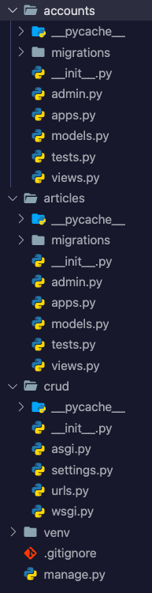

# Django로 웹사이트 만들기 1: 프로젝트 시작하기

#### Static vs. Dynamic Website

**Static**: 정해진 것 만을 제공해 주는 웹사이트

**Dynamic**: DB와의 통신을 거쳐서 사용자가 원하는 데이터를 동적으로 제공해 주는 웹사이트

장고의 경우 DB와의 통신까지 지원하는 server side framework이다


#### Django의 기본 동작 원리

**Model**: 데이터를 관리 해주는 역할 (MVC에서 Model과 같은 역할)

**Template**: 보여지는 페이지를 만드는 역할 (MVC에서 View와 같은 역할)

**View**: 어떤 동작을 수행할지 알려주는 중간 관리자 (MVC에서 Controller와 같은 역할)

**(+) urls.py:** 어떤 특정 경로로 들어온 요청이 어느 view로 연결될지 알려주는 기능

**요청 처리 순서**: urls를 통한 요청 ---> view 함수로 연결 --> model에서 필요 정보 수집 --> template render


#### 가상환경 설정하기 (선택)

선택사항이지만 프로젝트의 독립적인 관리를 위해서는 가상환경을 사용하는것이 좋다!

각 프로젝트마다 필요한 패키지, 버젼등등이 다를 수 있기 때문에 새로운 가상환경을 하나 설치에서 그 가상환경안에 알맞는 버젼의 패키지를 깔아주면 된다

1. 가상환경 생성

```bash
$ python -m venv venv
```

2. 가상환경 activate

```bash
$ source venv/bin/activate
```

3. 장고 설치

```bash
$ pip install django
```

4. (optional) 진행되고 있는 프로젝트를 받아와서 requirements 파일이 이미 있는 경우

```bash
$ pip install -r requirements.txt
```


#### 장고 프로젝트 시작하기

터미널에서 다음 코드를 입력하면 된다

```bash
$ django-admin startproject <project_name>
```

crud라는 이름의 프로젝트를 만드려면:

```bash
$ django-admin startproject crud
```


#### 새로운 앱 추가하기

**App**: 장고 안에서 특정 기능을 수행하는 모듈들의 단위

1. 앱을 생성한다: articles와 accounts라는 이름의 앱을 생성해준다

```bash
$ python manage.py startapp articles
$ python manage.py startapp accounts
```

2. settings.py 파일안에 installed apps에 방금 만든 app을 추가한다

```python
INSTALLED_APPS = [
    # 1. local apps
  	'accounts',
    'articles',
    # 2. 3rd-party apps
    # 3. django apps
    'django.contrib.admin',
    'django.contrib.auth',
    'django.contrib.contenttypes',
    'django.contrib.sessions',
    'django.contrib.messages',
    'django.contrib.staticfiles',
]
```


**최종 파일 트리 모양**




#### Settings.py 설정하기

기본적인 세팅과 더불어 다음과 같이 추가 설정을 해준다

1. 언어와 지역 설정을 지역에 알맞게 해준다. 한국의 경우:

```python
LANGUAGE_CODE = 'ko-kr'

TIME_ZONE = 'Asia/Seoul'
```

2. 기본 templated을 찾을 수 있는 template 경로를 설정해준다

```python
TEMPLATES = [
  {
    'DIRS': [
      BASE_DIR / '<app_name>' / 'templates'
    ]
  }
]
```

3. Base User Model을 대체해준다 (나중에 회원가입, 로그인 기능에 필요한 User 모델을 초기 프로젝트를 만들때 대체 설정을 해줘야한다 -- 나중에는 매우 고치기 힘듬!)

   1. accounts/models.py에 다음 코드를 추가한다

   ```python
   from django.contrib.auth.models import AbstractUser
   
   class User(AbstractUser):
       pass
   ```

   2. settings.py 맨 밑에 다음 한줄을 추가한다

   ```python
   AUTH_USER_MODEL = 'accounts.User'
   ```

   

#### 장고 서버 실행하기

```bash
# manage.py가 있는 프로젝트 root_folder 안에서 실행해야함
$ pwd
~/<project_root_folder>

$ python manage.py runserver
```


