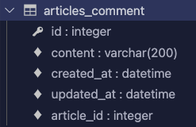

# Django CRUD 구현하기

- 가장 기본적인 CRUD
- 1:N 관계로 이루어져있는 모델들의 CRUD
- M:N 관계로 이루어져있는 모델들의 CRUD


## 기본적인 CRUD

1. 프로젝트 생성

```bash
$ django-admin startproject <project_name>
```

2. .gitignore 파일 생성

```bash
$ touch .gitignore
```

gitignore.io 에서 필요한 설정 파일 검색 후 복사 --> 붙여넣기

3. 가상환경 생성

```bash
$ python -m venv venv
```

3-1. 가상환경 activate

```bash
$ source venv/bin/activate
```

4. 패키지 설치 (optional: 이전 프로젝트를 pull 받아서 requirements 파일이 있는 경우)

```bash
$ pip install -r requirements.txt
```

5. 데이터 로딩 (optional: 협업 환경에서 만들어 진 불러올 데이터가 있는 경우)

   1. 데이터 파일을 <app_name>/fixtures/<app_name> 폴더 안에 저장 (template과 똑같은 구조)
   2. 데이터베이스에 데이터 저장

   ```bash
   $ python manage.py loaddata movies/movies.json
   ```


6. settings.py에서 기본 세팅 바꾸기

```python
TEMPLATES = [
  {
    'DIRS': [
      BASE_DIR / '<app_name>' / 'templates'
    ]
  }
]
...
LANGUAGE_CODE = 'ko-kr'
TIME_ZONE = 'Asia/Seoul'
```

7. 기본 생성 테이블 migrate 하기

```bash
$ python manage.py migrate
```

8. 서버 실행 시켜 보기

```bash
$ python manage.py runserver
```

9. app 만들기

```bash
$ python manage.py startapp <app_name>
```

10. settings.py에서 앱 추가

```python
# settings.py
INSTALLED_APPS = [
  '<app_name>',
  ...
]
```

11. base template 만들기
    - 프로젝트 폴더에서 templates 폴더 만들기
    - Base.html 생성 후 원하는 템플릿 파일
    - 부트스트랩 CDN등 포함하기 (getbootstrap에서 가져온 CDN을 활용하거나, django의 django-bootstrap5 활용)

12. app의 urls include 하기

```python
# <project>/urls.py
from django.urls import path, include

urlpatterns = [
    path('admin/', admin.site.urls),
    path('<app_name>/', include('<app_name>.urls')),
]
```

13. app에서 urls.py 파일과 templates/<app_name> folder 생성

14. app의 urls.py 에서 페이지 url 생성


## N:1 CR(U)D

참조 될 모델 (여기서는 게시글)과 그에 관련된 기능들은 이미 구현된 상태에서 시작

### 1. Model

1. **models.py**에서 N:1 관계 형성을 위해 모델을 하나 더 생성 (이 경우에는 N을 담당할 Comment 모델)

```python
class Comment(models.Model):
    article = models.ForeignKey(Article, on_delete=models.CASCADE)
    content = models.CharField(max_length=200)
    created_at = models.DateTimeField(auto_now_add=True)
    updated_at = models.DateTimeField(auto_now=True)
```

2. DB 모델 수정을 반영하기 위해 migration

```bash
$ python manage.py makemigrations
$ python manage.py migrate
```

3. DB에서 다음과 같이 테이블이 잘 생성되었는지 확인

   

   

### 2. Comment Create

***Comments는 이미 존재하는 article의 detail 페이지에 추가적으로 생성될 것이기 때문에 따로 페이지를 만들지 않고 articles:detail에 추가적으로 작성***

1. **forms.py**에서 Comment를 추가할 form 생성
   - 현재 있는 창에서는 현재 포스트에 대한 댓글만 달수 있도록, article field는 수정이 불가능하게 field 속성에서 미포함시키기

```python
from .models import Article, Comment

class CommentForm(forms.ModelForm):

    class Meta:
        model = Comment
        fields = ('content',)
```

2. **views.py** detail 함수에서 comment 생성을 위한 폼 전달

```python
from .forms import ArticleForm, CommentForm

@require_safe
def detail(request, pk):
    article = get_object_or_404(Article, pk=pk)
    comment_form = CommentForm()
    context = {
        'article': article,
        'comment_form': comment_form,
    }
    return render(request, 'articles/detail.html', context)
```

3. **urls.py**에서 comments 생성을 위한 경로 생성

```python
urlpatterns = [
    ...
    path('<int:pk>/comment/', views.create_comment, name='create_comment'),
]
```

4. **views.py**에서 comment 생성 로직을 위한 함수 생성
   - **POST**: post 요청만 가능
     - comment_form을 바로 저장하지 않고, comment 인스턴스만 먼저 생성
     - comment가 참조하는 article을 article 속성에 추가
     - form이 valid하지 않을 경우 디테일 창을 다시 return

```python
@require_POST
def create_comment(request, article_pk):
    article = get_object_or_404(Article, pk=article_pk)
    comment_form = CommentForm(request.POST)
    if comment_form.is_valid():
        comment = comment_form.save(commit=False)
        comment.article = article
        comment.save()
        return redirect('articles:detail', article.pk)
    context = {
        'comment_form': comment_form,
        'article': article, 
    }
    return render('articles/detail.html', article.pk, context)
```

5. templates의 detail 페이지에서 폼을 보여준다

```django
<h3>댓글 작성</h3>
<form action="" method="POST">
  
  {}
</form>
```


### 3. Comment Read

***Comments는 이미 존재하는 article의 detail 페이지에 추가적으로 생성될 것이기 때문에 따로 페이지를 만들지 않고 articles:detail에 추가적으로 작성***

0. (추가적인 설정) **models.py**에서 related_name을 설정한다
   - article에서 comment를 역참조 할때 comment가 어떻게 불리는지에 대한 이름을 설정해 주는 것
   - *주의: related name을 변경하는 것 만으로도 migration을 다시 해야함*

```python
class Comment(models.Model):
    article = models.ForeignKey(Article, on_delete=models.CASCADE, related_name="comment")
    ...
```

1. **views.py**에서 해당 article이 가지고 있는 comments를 쿼리셋의 형태로 불러옴
   - 전체 댓글이 몇개 있는지 모르기 때문에 queryset의 형태로 불러와야함
   - 1:N 참조이기 때문에 _set을 사용해서 queryset을 불러올 수 있음 --> related_name을 설정해 줬기 때문에 .comment를 바로 사용해도 comment들을 불러올 수 있음

```python
@require_safe
def detail(request, pk):
    ...
    comments = article.comment.all()
    context = {
        ...
        'comments': comments,
    }
    return render(request, 'articles/detail.html', context)
```

2. **templates**의 detail 페이지에서 comment를 보여준다
   - 댓글이 있다면 댓글을 보여주고
   - 추가적으로 댓글이 없다면, 댓글이 없다는 메세지를 보여준다

```html
<ul>
  
  	<li>{{ comment.content }}</li>
  
  	<h4>작성된 댓글이 없습니다.. :(</h4>
  
</ul>
```


### 4. Comment Delete

1. **urls.py** 에서 댓글 삭제 view 함수를 호출할 url을 만든다
   - Article_pk와 더불어 comment_pk도 인자로 받아야 한다
   - 무슨 pk인지 명시적으로 받기 위해 `article_pk`와 `comment_pk`라고 이름을 붙여준다

```python
urlpatterns = [
    path('<int:article_pk>/comment/<int:comment_pk>/delete', views.delete_comment, name='delete_comment'),
]

```

2. **views.py**에서 댓글 삭제를 실행할 함수를 만든다
   - POST 요청만 받기
   - 삭제 후에는 댓글이 원래 있었던 게시글의 detail 페이지로 redirect 해준다

```python
@require_POST
def delete_comment(request, article_pk, comment_pk):
  	# 이 부분은 추가적인 유저 인증을 위해서 넣었지만, 로그인 기능이 구현되어 있지 않은 상태에서는 동작하지 않으므로 빼야한다
    if request.user.is_authenticated:
        comment = get_object_or_404(Comment, pk=comment_pk)
        comment.delete()
    return redirect('articles:detail')
```

3. **templates**의 detail 페이지에서 댓글 삭제를 위한 버튼을 포함한 폼을 만들어 보여준다

```html
<!-- comment read 부분 코드에서 추가 작성 -->
<ul>
  
  	<li>{{ comment.content }}</li>
    <form action="" method="POST">
      
      <input type="submit" value="댓글 삭제">
    </form>
  
  	<h4>작성된 댓글이 없습니다.. :(</h4>
  
</ul>
```

