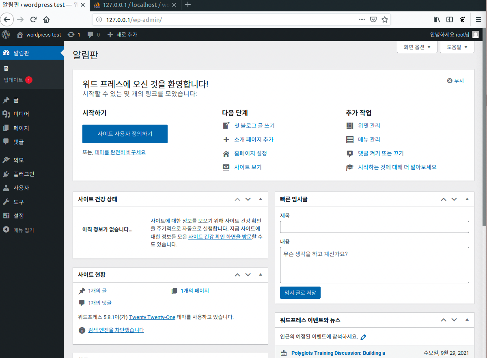

# 도커로 서비스 구축하기 (Full Cycle)

Word Press 서비스를 구축하는 전체 과정

1. 필요한 이미지 검색 및 풀 받기 (가상환경을 세팅해주는 이미지)
2. 다운받은 이미지로 컨테이너 실행하기
3. Wordpress 파일 다운 받기
4. 컨테이너로 접속하기
5. 파일 정리하기


1. 필요한 이미지 검색 및 풀 받기 (가상환경을 세팅해주는 이미지)

```bash
$ docker search xampp
$ docker pull tomsik68/xampp

# 이미지 확인
$ docker images
```


2. 다운 받은 이미지로 컨테이너 실행하기

```bash
$ docker run --name WP -p 80:80 -d --rm tomsik68/xampp

# 컨테이너 확인
$ docker ps
```


3. Wordpress 파일 다운 받기 & 압축 풀기

```bash
$ wget https://ko.wordpress.org/latest-ko_KR.tar.gz
$ tar -xf latest-ko_KR.tar.gz
```


4. 컨테이너로 접속하기

```bash
$ sudo docker exec -it WP bash
```


5. (컨테이너 쉘) 파일 정리하기

```bash
# 권한 부여
root@<container>$ chown daemon. /opt/lampp/htdocs
# 파일 백업 및 이동
root@<container>$ cd /opt/lampp/htdocs
root@<container>$ mkdir backup
root@<container>$ mv * ./backup/
# 쉘 종료
root@<container>$ exit
```


6. Wordpress 파일을 컨테이너로 복사하기

```bash
# wordpress 파일을 WP 컨테이너 안 해당 경로로 복사
$ docker cp wordpress WP:/opt/lampp/htdocs
```

컨테이너로 접속하여 복사된 파일을 확인 후, wordpress 사용을 위해 파일들을 알맞는 경로로 옮겨준다

```bash
# 컨테이너로 재접속 후 복사된 파일 확인
$ sudo docker exec -it WP bash
root@<container>$ cd /opt/lampp/htdocs
# wordpress 폴더 안에 있는 파일들을 상위 폴더 (/opt/lampp/htdocs)로 옮겨준다
root@<container>$ cd wordpress
root@<container>$ mv * ../
```


7. Wordpress 서비스 실행 및 초기 설정

- 브라우저에서 로컬호스트 80번 포트로 접속 `http://127.0.0.1/`
- DB 설정
  - `127.0.0.1/phpmyadmin` 으로 접속
  - 새 데이터베이스 생성
- 사용자 정보 생성 페이지로 돌아가서 페이지 생성을 완료
- 로그인 하여 페이지가 정상적으로 동작하는지 확인




8. 이미지 저장 및 푸쉬하기

```bash
$ docker stop WP
$ docker commit WP <user_name>/<image_name>
$ docker push <user_name>/<image_name>
```


9. 기존 이미지를 지운 후 푸쉬한 이미지로 컨테이너 재실행

```bash
# 현재 실행중인 모든 컨테이너 삭제
$ docker rm `docker ps -a -q`
# 로컬에 있는 빌드한 이미지 삭제
$ docker rmi <user_name>/<image_name>
```

```bash
# 재 다운로드
$ docker pull <user_name>/<image_name>
$ docker run --name WP -p 80:80 -d --rm <user_name>/<image_name>
```

