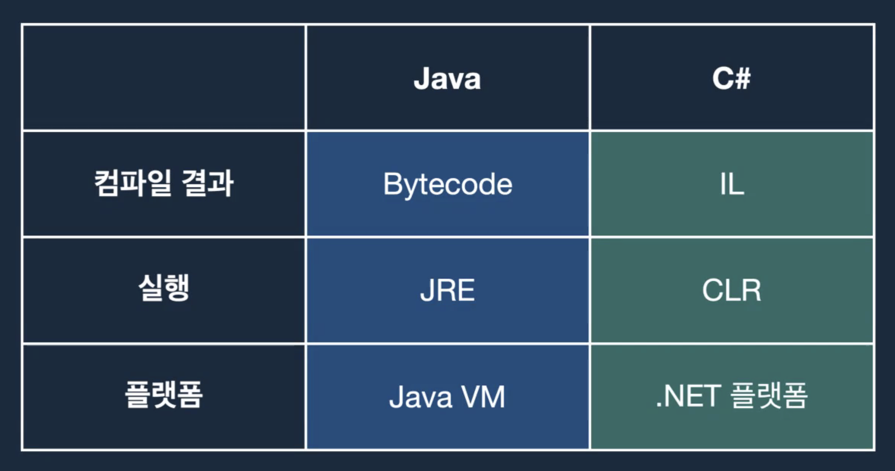

# C# 기초


### Java vs. C# 실행환경의 차이




### Java vs. C# 코딩 언어의 차이

변수 선언 방법 (Generic)

```java
Pair<String, String>[] pairs = new Pair[10]
```


```c#
object pairs = new Pair<int, string>[10]
```


다형성

```c#
class Animal {
  public virtual void Sound() {}
}

class Dog {
  public override void Sound() {}
}
```


배열

```java
```

