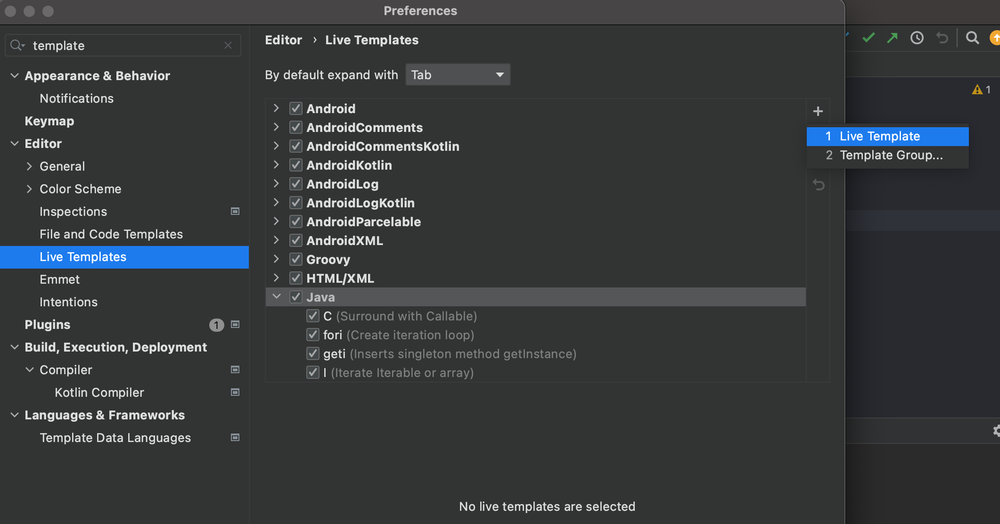
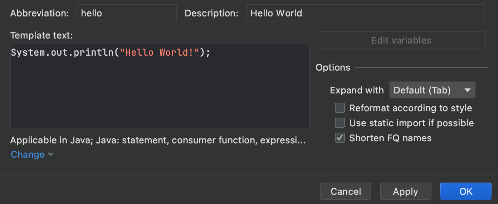

Mac 기준 내가 개발을 하면서 유용하다고 느낀 IntelliJ 단축키 + 키보드 약어 모음을 정리해보았다.

### IntelliJ 단축키

#### 1. 기본
`cmd` + `shift` + `/`: 여러 줄 주석

`cmd` + `shift` + `enter` : 세미콜론 추가 + 줄 끝으로 이동

`cmd` + `d` : 현재 커서가 위치한 행 복제 (여러 행 선택 후 한꺼번에 가능)

`ctrl` + `shift`+`R`: 파일 실행

`ctrl` + `g`: 선택된 단어의 다음 occurance 선택

`cmd` + `ctrl` + `g` : 현재 파일 내에 같은 단어 전체 선택

`cmd` + `option` + `l` : 코드 자동 정렬

#### 2. 코드 자동 완성

`cmd` + `n` : 함수 자동 생성하기 (생성자 함수, getter / setter, toString...)

`cmd` + `d` : 선택된 행 복붙 (여러 행 한꺼번에 가능)

`cmd` + `shift` + `enter` : 세미콜론 포함해서 자동완성

`cmd` + `option` + `v` : 타입에 맞게 변수 생성 및 이름 자동완성

`ctrl` + `t` : refactoring 관련 메뉴 팝업 (e.g. extract method)

`cmd` + `option` + `m` : 메서드 생성

`option` + `enter` : 자동 import

`cmd` + `shift` + `t` : 테스트 클래스 생성

### 약어
IntelliJ에서는 약어를 입력한 후 `Enter` 키를 누르면 특정 코드 snippet이 자동 생성되는데, 내가 자주 쓰는 것들을 모아 정리해보았다.
- `psvm` / `main`: public static void main
- `sout`: System.out.println
- `fori`: index `i` 를 사용한 for문 자동 완성
- `foreach`: `foreach`문 자동 완성 

### 새로운 약어 등록하기
**Mac 기준**
1. `IntelliJIDEA > Preferences > Editor > Live Templates`로 들어간다
2. 새로운 약어를 등록하고 싶은 언어를 선택한 뒤 (내 경우 `Java`)
3. 우측의 `+ > 1.Live Template` 을 선택한다

4. 새로운 약어를 등록한다
- `Abbreviation`: 약어
- `Description`: 설명
- `Template text`: 입력될 템플릿 코드

5. 하단의 `Change` 또는 `Define` (아직 선택된게 없을 경우) Dropdown을 클릭해, 어떤 언어나 context에서 해당 약어를 사용할지 지정한다. (이 경우 `Java` 아래의 모든것들을 전체 선택하였다)
6. `Apply` > `OK` 를 눌러주면 끝!

이렇게 설정을 완료해두면, `.java` 코드 파일에서 `hello`를 입력하고 `Enter` 또는 `tab` 키를 눌렀을때, 저장된 template text가 자동으로 생성된다.