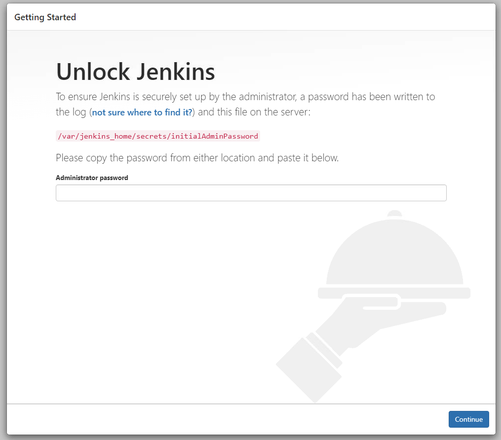
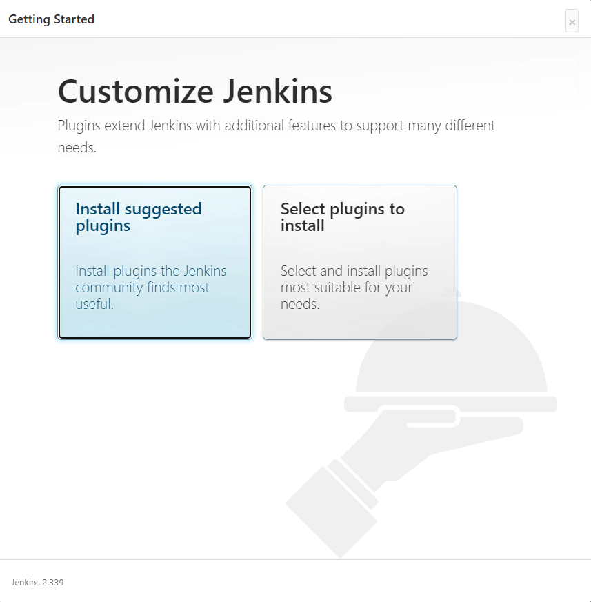

# Bitbucket + Jenkins로 Spring Boot Application 자동 배포하기

### 개요


### 1. 준비하기

#### 1.1. Docker 설치

<a href="https://docs.docker.com/get-docker/">Docker 홈페이지</a>에서 docker를 다운 받는다.

설치가 완료된 후, cmd / bash 창을 열어 아래 명령어를 입력해 설치가 완료되었는지 확인한다. (버전명이 뜬다면 설치 성공!)

```bash
$ docker -v
```


#### 1.2. Jenkins 설치

방금 설치한 Docker를 활용해 Jenkins를 설치해 볼 예정이다. Docker를 활용하는데에는 장단점이 있지만, 크게 아래와 같은 장점들이 있다.

- Jenkins 설치 및 초기 세팅이 간단하고 쉽다
- 추가적인 tool이 필요할때 해당 docker image만 pull해서 사용하면 되기 때문에, 확장성에 용이하다
- 최신화 된 Jenkins 이미지를 사용하면, 어디서나 동일하게 환경설정이 가능하다

Jenkins를 설치하는 방법은 아래와 같다

1. 이미지 다운로드 받기

```bash
$ docker pull jenkins/jenkins
```

2. 이미지 확인

```bash
$ docker images
```

`jenkins/jenkins` 라는 이름의 이미지가 잘 다운로드 받아졌는지 확인한다.


3. Docker 실행

```bash
$ docker run -d --name jenkins -p 8081:8080 jenkins/jenkins
```

- `-d`: 백그라운드에서 프로세스 실행

- `--name jenkins`: 컨테이너 이름을 jenkins로 지정
- `-p 8081:8080`: 호스트의 8081 포트를 내부의 8080 포트로 바인딩
  - 내 프로젝트 같은 경우에는 스프링부트에서 8080 포트를 사용할 예정이라, 호스트의 8081 포트를 연결해주었다. 내부 포트 같은 경우에는 이 컨테이너 안에서는 젠킨스 하나만 돌아가고 있기 때문에 8080으로 그대로 사용해도 무방하다

4. Jenkins 접속 및 비밀번호 설정

`8081` 포트와 매핑해주었기 때문에, `localhost:8081` 로 브라우저에서 접속해준다


설치 직후에 cmd 창에서 아래 명령어를 입력하면 비밀번호를 확인할 수 있다

```bash
$ docker logs jenkins
```




### 2. Jenkins 기본 설정

#### 2.1 Plugin 설치

