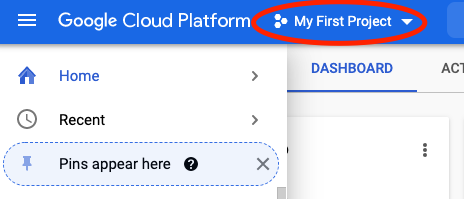
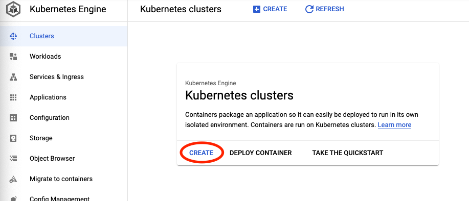
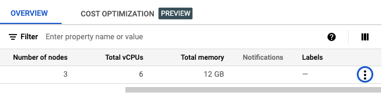

# Google Kubernetes Engine (GKE)

### 우분투에서 쿠버네티스 클러스터 구성하기

1. **프로젝트 생성하기:** 좌측 상단 프로젝트 목록 부분 클릭 > New Project

2. Kubernetes API 활성화 하기: 좌측 메뉴바에서 Kubernetes Engine > Enable

3. **Kubernetes Cluster** 만들기

세부설정

- GKE Standard 선택

4. **Cluster 연결하기:** `...` > `Connect` > `Run in Cloud Shell`

   생성된 worker node를 관리할 수 있는 kubectl 터미널을 열 수 있다

   

   

5. **Cloud Shell 사용하기:** 인증 정보가 입력되어 있는 상태에서 Enter 키를 누르면, Cloud Console로 접속 되고, Kubenetes Cluster를 관리할 수 있는 Kubectl Terminal이 열린다

