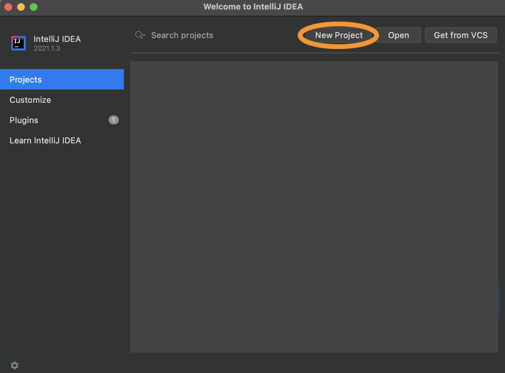
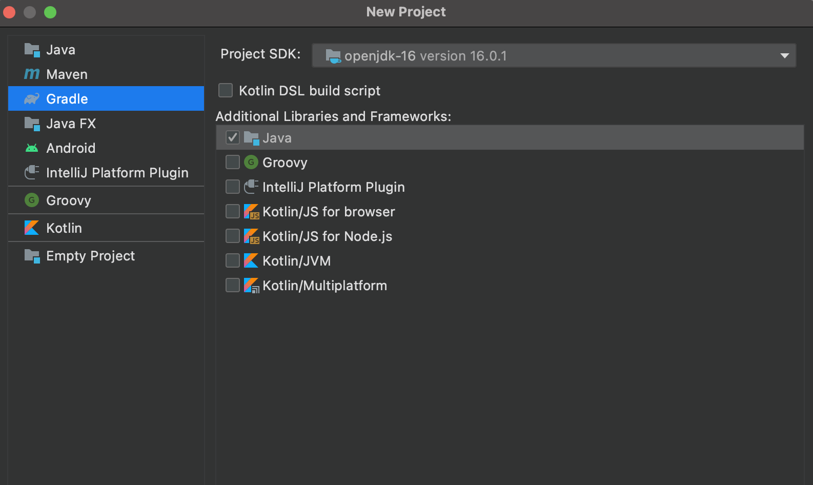
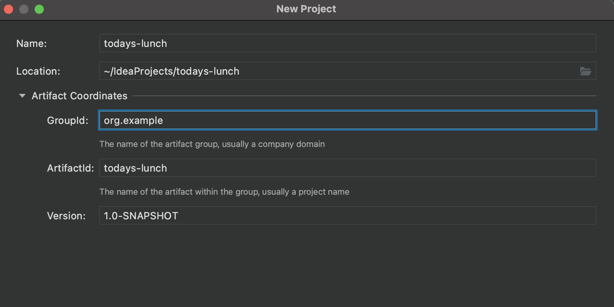
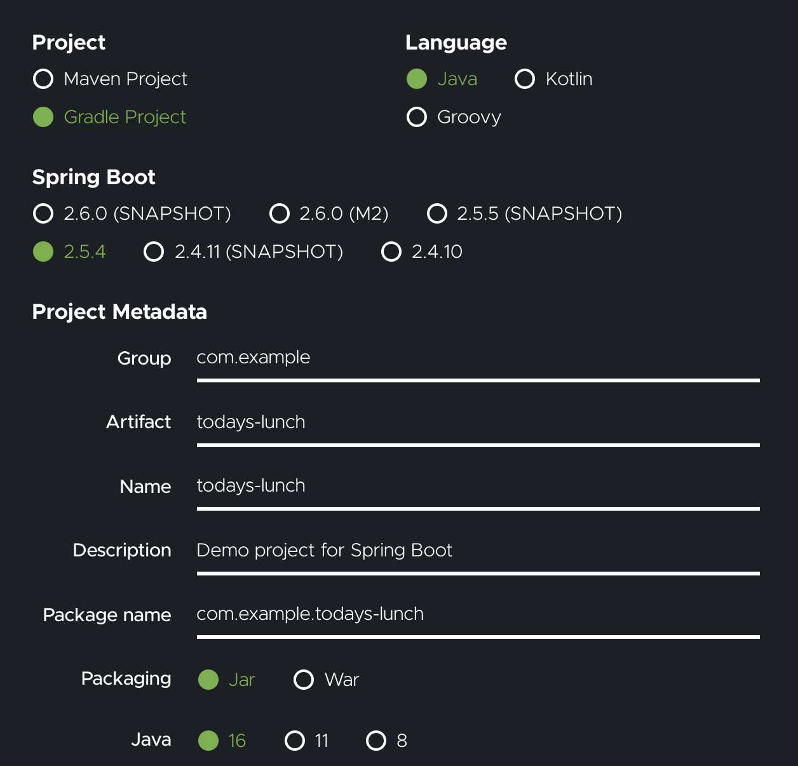
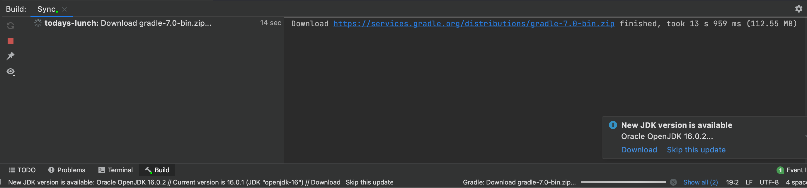
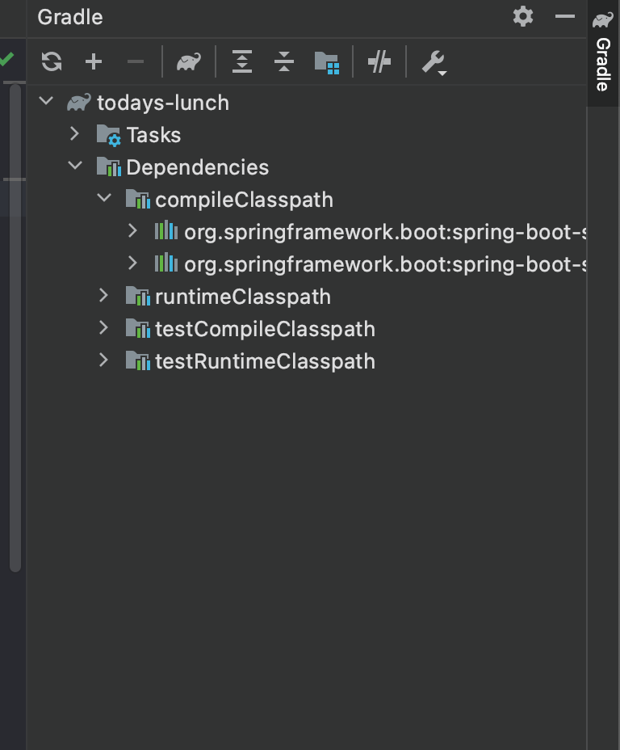

# Spring Project 시작하기

### 사전 준비

> 1. Java가 다운로드 되어 있어야 한다 - 터미널에서 `java -version` 명령어로 확인
>
> 2. Gradle이 다운로드 되어 있어야 한다 - 터미널에서 `gralde -version`  명령어로 확인
> 3. Java 프로젝트를 실행할 수 있는 IDE (IntelliJ, Eclipse...) 중 하나가 설치되어 있어야 한다 - 나는 인텔리제이 사용 예정!


### 프로젝트 시작하기

1. Create New Project 버튼을 클릭해 새 프로젝트를 생성한다




프로젝트 생성 시 다음 항목을 확인하고 생성해주어야 된다.

- 좌측 메뉴에 Maven / Gradle 중 사용할 빌드 툴 선택 (나 같은 경우 gradle 사용!)
- Project SDK: 사용할 Java 버젼 선택
- Additional Libraries and Framework: Java 선택




2. 프로젝트 설정을 해준다
   - Name: 프로젝트의 이름
   - GroupId: 그룹 이름 - 메인 로직이 작성 될 코드가 들어있는 경로에 이름으로 지정된다
   - ArtifactId: 주로 프로젝트의 이름과 동일하고, 프로젝트의 루트 폴더도 같은 이름으로 기본적으로 세팅된다




3. 프로젝트 파일 트리에서 `build.gradle` 파일을 연다
4. <a href="https://start.spring.io/">Spring Initializr</a> 웹사이트에서 필요한 설정을 완료한 코드를 복사해 받아온 다음, `build.gradle` 파일에 덮어쓴다 - 아래 설정 참고



5. 바뀐 Gradle 설정을 apply 해준다

   1. "Gradle projects need to be imported" 라는 팝업 창이 뜬다면, Import Changes 또는 Enable Auto Import를 눌러 필요한 패키지들을 받아온다
   2. 만약 팝업이 뜨지 않는다면 화면 하단의 build 버튼을 클릭한 후, 왼쪽의 새로고침 아이콘을 클릭해 새로운 설정을 업데이트 해준다

   

6. 화면 우측의 gradle 탭을 클릭한 후,  `dependencies > compileClasspath` 폴더 안에 dependency에 추가한 항목들이 제대로 다운 받아 졌는지 확인한다




### build.gradle 파일 파헤치기
`build.gradle` 파일은 프로젝트 실행에 필요한 빌드 설정과 외부 의존성 패키지들의 대한 정보를 관리하는 파일이다.

```groovy
plugins {
    id 'org.springframework.boot' version '2.5.4'
    id 'io.spring.dependency-management' version '1.0.11.RELEASE'
    id 'java'
}

group = 'com.example'
version = '1.0-SNAPSHOT'
sourceCompatibility = '16'

repositories {
    mavenCentral()
}

dependencies {
    implementation 'org.springframework.boot:spring-boot-starter-data-jpa'
    implementation 'org.springframework.boot:spring-boot-starter-web'
    testImplementation 'org.springframework.boot:spring-boot-starter-test'
}

test {
    useJUnitPlatform()
}
```


