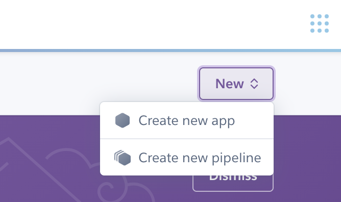
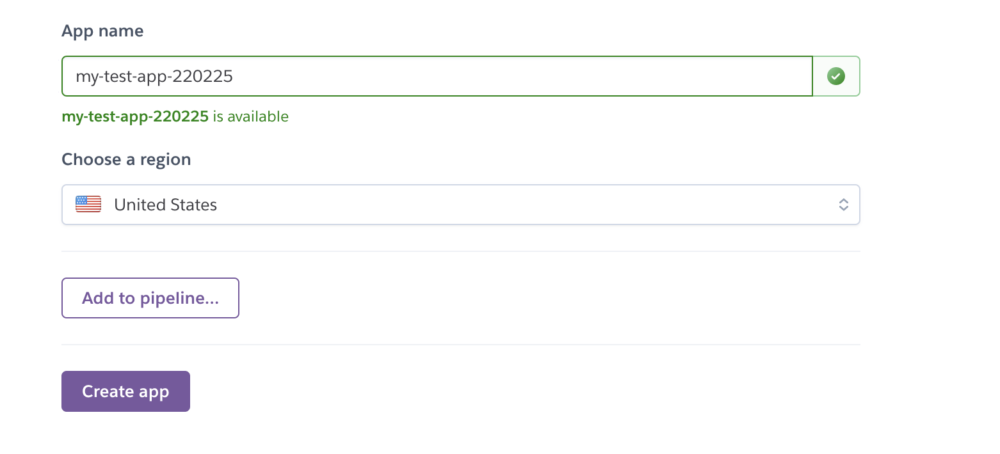
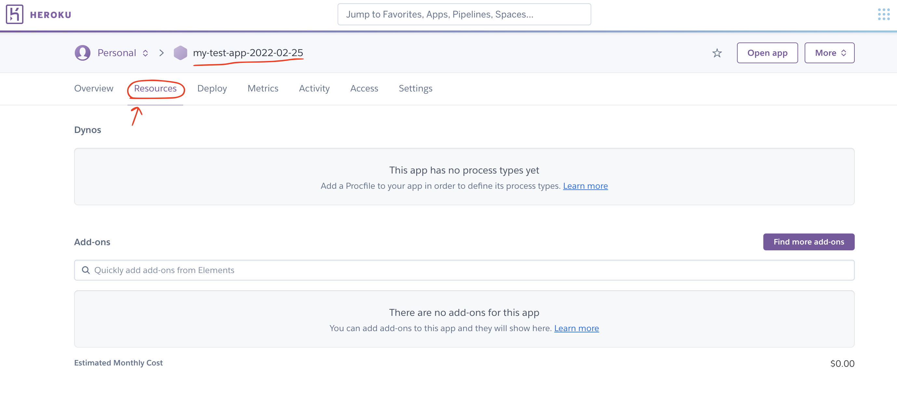
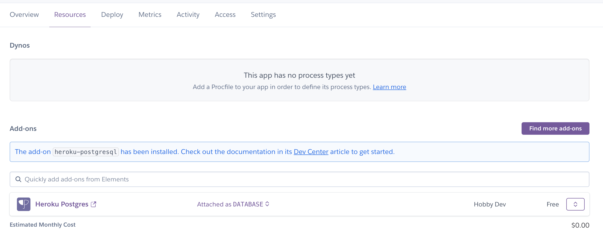
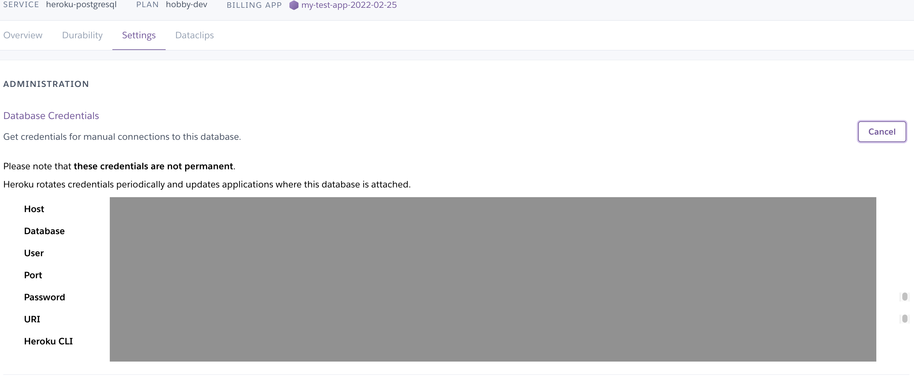

# 1. Spring Boot 프로젝트에 Heroku PostgreSQL DB 연결하기

### 개요

Spring Boot 앱을 개발하면서, 여러 사람들과 함께 협업하면서 작업할 예정이기 때문에, 같이 공유하면서 작업할 수 있는 데이터베이스를 개설하고 사용하기로 하였다. 추후에 웹사이트를 배포할때에도, 로컬 환경이 아닌 DB로의 접속은 필수적으로 필요하기 때문에, 프로젝트를 시작하면서 DB와 연결하는 작업을 가장 먼저 해주었다.

우리는 무료로 클라우드 데이터베이스를 제공하는 곳들 중 Heroku라는 곳의 DB를 사용하기로 하였다.

- 1GB / 최대 10,000건의 데이터 무료 사용 가능 (토이 프로젝트 규모로는 충분)
- 사용 기간의 제약 없음
- PostgreSQL DB 제공 (가장 익숙히 알고 있는 mySQL과 거의 동일한 문법)


### 준비 사항

1. Heroku 회원가입
2. <a href="https://devcenter.heroku.com/articles/heroku-cli#install-the-heroku-cli">Heroku CLI 설치</a> (미 설치시에도 진행은 가능하나 해당 블로그 포스트에서는 다룰 예정)
3. <a href="https://www.postgresql.org/download/">PostgreSQL 설치</a>
4. <a href="https://www.pgadmin.org/download/">PgAdmin4 설치</a> (선택)


### 데이터베이스 생성

1. Heroku 웹사이트로 로그인 후, 새로운 앱을 생성한다. Region은 미국으로 지정해주었다.

   



2. 앱 생성 후, 앱의 메인 페이지로 들어와 Resources 탭을 클릭



3. Add-ons 섹션에서 `Heroku Postgres`를 검색해 추가한다.
4. Plan name에 `Hobby Dev - Free`를 선택하고 "Submit Order Form" 버튼을 클릭한다
5. Resources 탭에 Heroku Postgres가 성공적으로 추가된 것을 확인하면 완료!



### 데이터베이스 확인 & 테스트

생성된 데이터베이스를 클릭하면 상세페이지로 넘어갈 수 있는데, 여기서 데이터베이스에 대한 세부 정보들을 확인할 수 있다

그 중, Settings, 탭에 들어가면 Database 연결 관련된 정보를 확인할 수 있는데, 여기 있는 정보들을 활용해 Spring Boot에서 DB와 연결을 완료해야한다




### Spring Boot 설정

1. `build.gradle` 파일에 dependency들을 추가해준다
   - Postgresql과 log4의 경우, 주석에 있는 url 링크를 통해 최신 버전에 대한 build.gradle 설정 코드를 찾을 수 있다
   - *주의: `build.gradle` 파일을 업데이트 한 이후에는 꼭 새로고침을 해서 새로운 패키지들을 다운 받아 준다

```java
dependencies {
	// 필수
	implementation 'org.springframework.boot:spring-boot-starter-jdbc'	
	// https://mvnrepository.com/artifact/org.postgresql/postgresql
	implementation group: 'org.postgresql', name: 'postgresql', version: '42.3.3'

  // 선택: SQL를 편하게 보기 위한 log4 추가
	// https://mvnrepository.com/artifact/org.bgee.log4jdbc-log4j2/log4jdbc-log4j2-jdbc4.1
	implementation group: 'org.bgee.log4jdbc-log4j2', name: 'log4jdbc-log4j2-jdbc4.1', version: '1.16'

}
```


2. `application.properties` 파일에 DB 설정 관련 정보를 추가해준다

여기서 필요한 정보들을 앞서 말한 Settings 페이지에서 전부 찾을 수 있다

```java
spring.datasource.hikari.maximum-pool-size=4
spring.datasource.url=jdbc:postgresql://<Host>/<Database>
spring.datasource.username=<User>
spring.datasource.password=<Password>
spring.datasource.platform=postgres
```


이렇게 하면 모든 설정이 완료되었다! - 실제 DB가 제대로 연결된건지 확인하기 위해 첫번째 API 코드를 작성하는 것을 진행해보자!