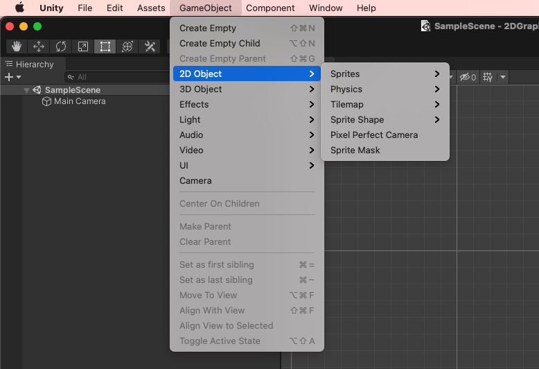

# Unity 개발

#### Game Object 사용하는 법

1. Template Object




### Unity Hierarchy

- Object
  - Component
    - Behavior
      - MonoBehavior
    - Transform
    - Collider
  - Game Object
  - ScriptableObject


### Unity의 Object 관련된 내장 Methods

`UnityEngine.Object`

`UnityEngine.Component`

```c#
// GameObject를 가져오기
public GameObject gameObject;

// 현재 Collider 위에 마우스가 있는 동안에 클릭했을 때
void OnMouseDown()
{
}
```

`UnityEngine.GameObject`

```c#
// GameObject의 visibility 제어
public void SetActive(bool value);
```

`UnityEngine.Component`

```c#
// T 타입의 컴포넌트를 찾아서 반환
// 없을경우 null 반환
public T GetComponent<T>();
```

`UnityEngine.Animator`

```c#
public void SetBool(string name, bool value);
```

UnityEngine.Camera

```csharp
public float aspect;
public float orthographicSize;

public static Camera main;
```


UnityEngine.AudioSource

```csharp
public void Play();
```

