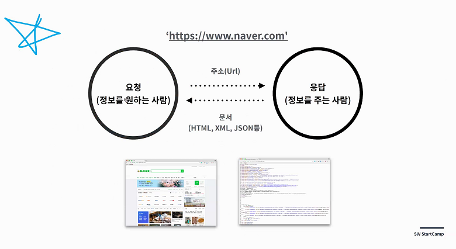
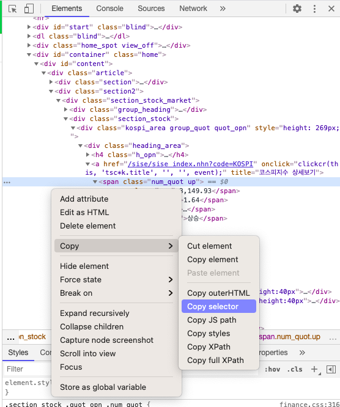

## 2021-01-14 Web Programming Introduction

### Web Programming 기초

웹은 매우 기본적인 레벨에서 **요청(Requests)** 과 **응답(Response)** 으로 이루어져있다



#### 요청 (Request)

- Client에서 정보를 요청하는 일
- GET: 요청을 통해 원하는 정보를 받아오는 일 (주소창을 통해 요청하는 모든 것)

#### 응답 (Response)

- Server에서 요청받은 정보를 반환하는 일
- Requests가 valid한지 아닌지에 따라서 status code로 나타내서 같이 반환한다 (200, 201, 404, 502...)
  - 20X - 정상요청
  - 40X - 잘못된 리퀘스트
  - 50X - 서버에러
- 보통 웹에서 응답을 받아올때는 json 형식으로 된 데이터를 받아온다 (json != dict)
  - JSON은 Python에 dict랑 형태는 똑같지만 String으로 인식되기때문에 json.loads같은 함수가 필요하다

### 정보를 얻어오는 방법

1. 웹 크롤링: 웹에서 필요한 정보를 스크래핑 해서 가져오는 것
   - HTML / CSS에서 selector를 사용해 원하는 정보를 뽑아오는 것
2. API: 형식에 기반한 정보 교환
   - Ex) Data.go.kr
   - JSON, XML, CSV 등등의 형식으로 되어있음
   - 요청 형식에 맞춰서 요청을 보내면 원하는 데이터를 응답값으로 전달해준다
   - 요청 횟수, 요청 방식 (Key)이 제한되어 있는 경우가 많음

### Requests를 사용해서 정보 요청하기 (웹 크롤링)

1. 요청을 보내서 **HTML 형태로 된 응답** 받아오기

```python
import requests

# url의 본문 가져오기
response = requests.get('url').text

# status code 가져오기
status = requests.get('url').status_code
```

2. **Selector**를 사용해서 원하는 정보를 뽑아온다

   웹 브라우저 상에서 selector 찾는 법: 개발자 도구 --> 우클릭 --> 다음과 같이 선택




3. 뽑아온 selector를 활용해 정보를 가져온다

```python
soup = BeautifulSoup(data, 'html.parser')
kospi = soup.select_one('#KOSPI_now')
```


Requests를 사용한 크롤링 예제

```python
import requests

# url의 본문 가져오기
requests.get('https://finance.naver.com/main/main.nhn').text

# status code 가져오기
requests.get('url').status_code

```


### Requests를 사용해서 정보 요청하기 (API)