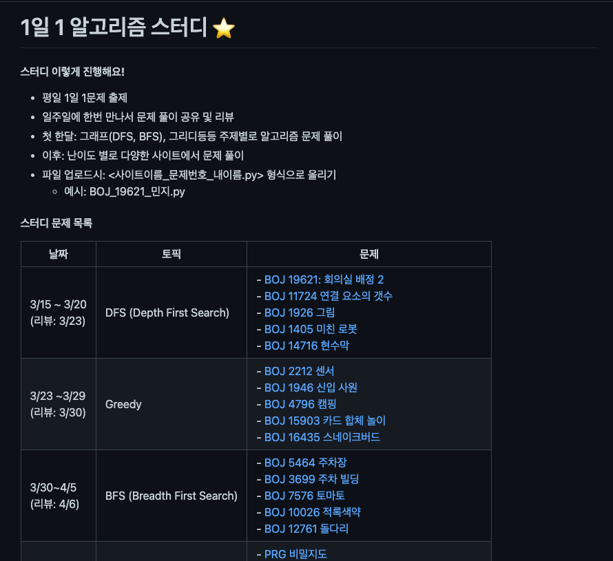
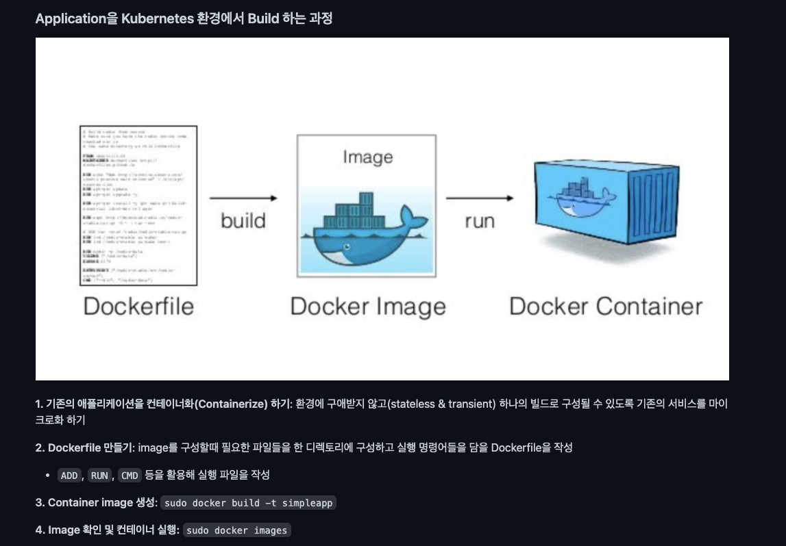
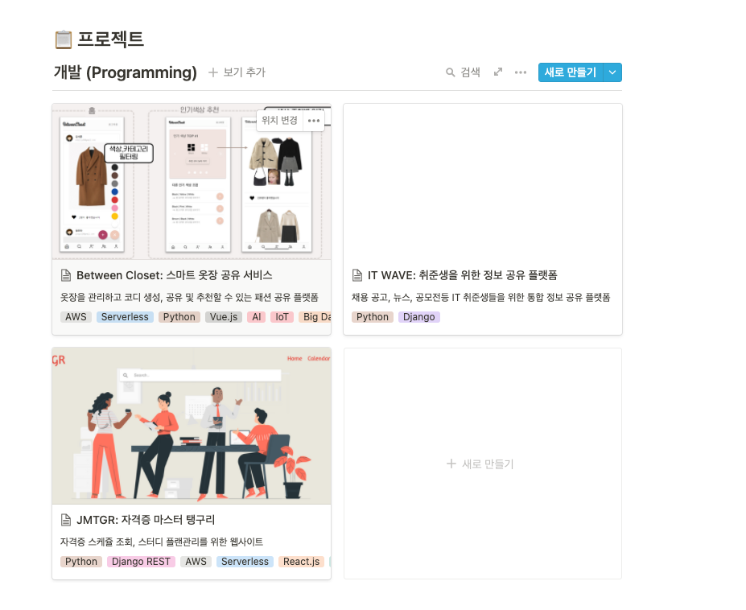
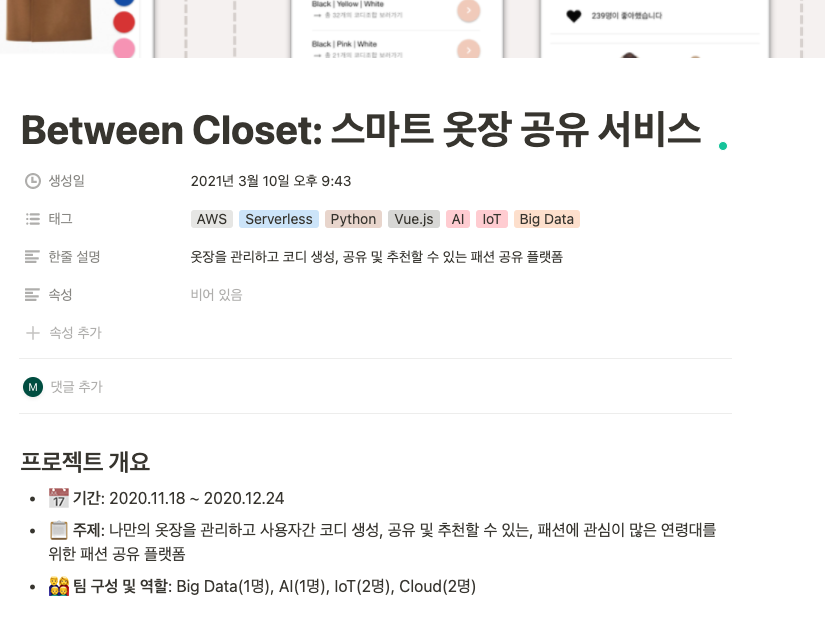
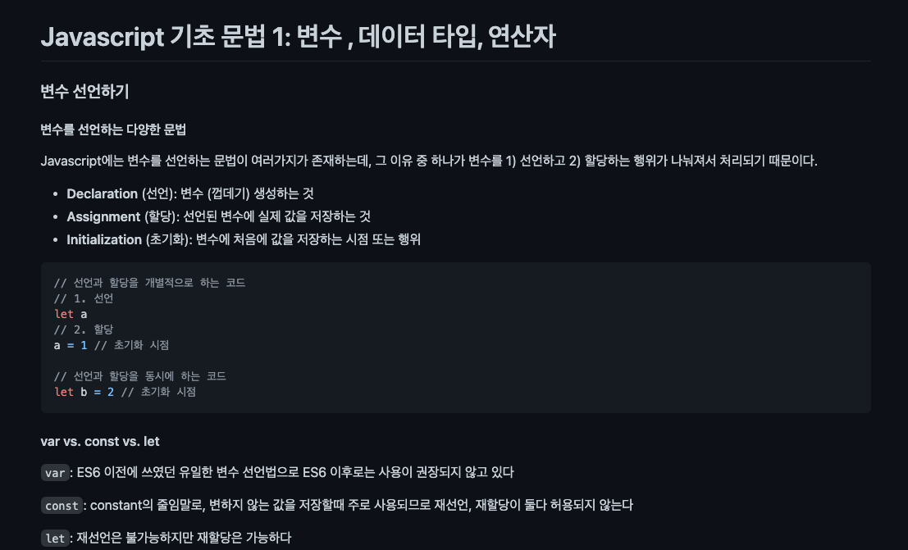
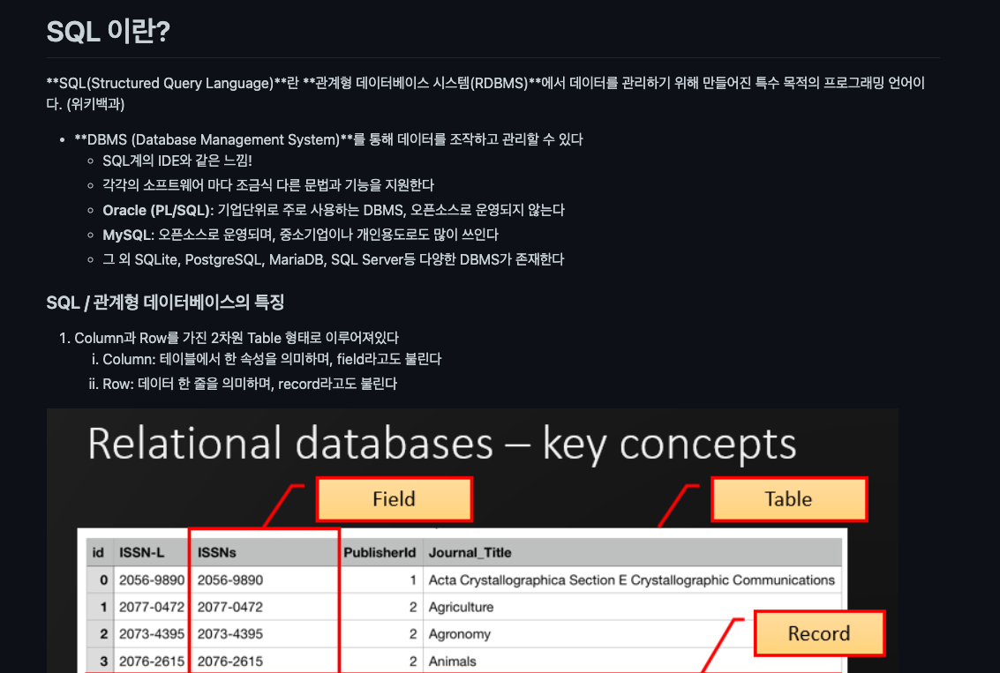

# 민지 스터디 모음

### 개인 개발공부(+취업) 를 위해 준비했던 것들

#### **알고리즘 스터디 - 서울 5반**

- **참고 링크**: https://github.com/SSAFY5-Algorithm-Study/SSAFY5-Algorithm

- **스터디 방식**
  - 일주일 5문제 선정 --> 1주일에 1회 디스코드로 스터디
  - 문제 풀이 코드 깃허브로 업로드
  - 각자 맡은 문제 설명

#### CKAD (Kubernetes) 자격증 스터디

- **참고 링크**: https://github.com/Kucloud-K8s-Study/Kuloud_k8s_study

- **스터디 방식**
  - 동영상 강의 결제 후 시청
  - 강의 내용을 TIL 방식으로 마크다운으로 정리
  - 1주일에 1회 각자 맡은 토픽을 설명

#### 개인 포트폴리오

- 참고 링크: https://www.notion.so/MINJI-KIM-421a0740852a4365a343f80091bea842 
- 작성 방식
  - 노션을 활용해서 포트폴리오를 만들었습니다
  - 자기소개, 학력, tech stack, 진행했던 프로젝트, 경력사항등을 작성했습니다 :)

#### TIL 작성

- 스터디 방식

  - 프로젝트를 하면서 배웠던 내용들과 혼자 개발을 공부하면서 배웠던 내용들을 정리했습니다.
  - 이 중 내용들을 골라서 블로그에 올리는걸 조금씩 하고있습니당..!
  - 블로그 참고 링크: https://minnczi.github.io/ (지금 블로그를 옮기려고 하고 있어서 이 블로그는 조금 부실합니다ㅠㅠㅠ)

  

  

#### GSAT 스터디

- 스터디 방식
  - 스터디 팀원들과 디스코드에 모여서 실제 시간을 측정하여 GSAT 문제 풀이
  - 이후 30분-1시간 문제 리뷰

#### SQLD 자격증

- 스터디 방식
  - 24시간의 전사가 되어 벼락치기에 성공했습니다...
